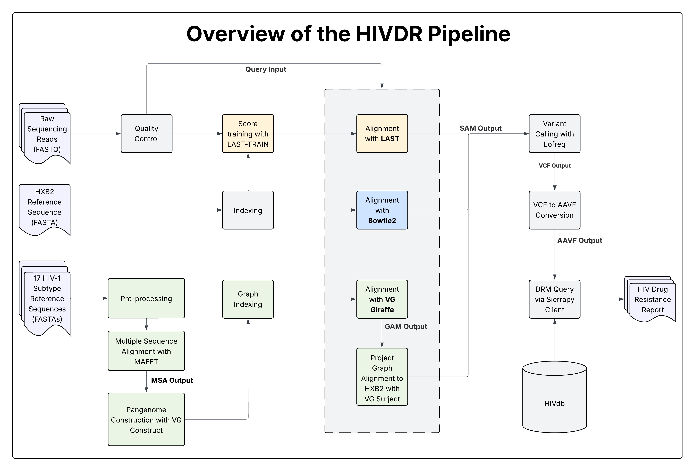

# Pangenome Graph-Based HIV Drug Resistance Profiling Pipeline

A Snakemake-based workflow for detecting HIV drug resistance mutations (DRMs) from NGS data.
The pipeline supports **three alignment strategies**:

* **Bowtie2** – conventional linear-reference alignment
* **LAST** – adaptive-scoring alignment (with parameters trained via LAST-TRAIN)
* **VG Giraffe / VG Map** – graph-based alignment against a pangenome constructed from diverse HIV-1 group M reference genomes

The workflow uses the **VG toolkit**, **MAFFT**, and standard NGS tools to construct a pangenome graph (when selected), align reads, call variants, convert results to AAVF, and optionally generate HIV drug resistance interpretations using HIVdb.



## What This Pipeline Does

This pipeline performs the following key steps:

### **1. Input Preparation**

* Accepts curated HIV reference genomes (FASTA)
* Accepts raw NGS reads (FASTQ)


### **2. Graph Construction (Only when using VG Alignment)**

If the VG-based alignment strategy is selected, the pipeline will:

* Perform multiple sequence alignment using **MAFFT**
* Construct a variation graph using **vg construct**
* Index the graph using `vg index`, `vg gbwt`, and related VG indexing tools

*(This entire step is skipped for Bowtie2 and LAST.)*


### **3. Alignment**

All supported alignment methods are unified here:

* **Bowtie2** — standard linear alignment to HXB2 or a user-specified reference
* **LAST** — adaptive-scoring alignment trained with LAST-TRAIN, improving mapping accuracy for divergent sequences
* **VG Giraffe** — graph-based alignment to the constructed pangenome graph

Each method outputs SAM/BAM alignment files for downstream processing.


### **4. Variant Calling**

* Calls variants from either linear or graph alignments using **vg call**
* Produces per-sample **VCF** files
* Converts VCF → **AAVF** using a custom Python script


### **5. Drug Resistance Mutation Identification & Interpretation**

* Queries AAVF files against **HIVdb** using the **sierrapy** client
* Produces a structured HIV drug resistance profile


## Installation

This pipeline requires:

* [Miniconda](https://docs.conda.io/en/latest/miniconda.html)
* [Snakemake](https://snakemake.readthedocs.io)

All tool dependencies are managed via Snakemake’s `--use-conda` functionality.

### Step 1: Install Miniconda

Follow the official installation guide:
[https://docs.conda.io/en/latest/miniconda.html](https://docs.conda.io/en/latest/miniconda.html)

Verify the installation:

```bash
conda list
```

### Step 2: Install Snakemake

We recommend using **mamba** for faster environment resolution:

```bash
conda install -c conda-forge mamba
mamba create -c conda-forge -c bioconda -n <env_name> snakemake
conda activate <env_name>
```

Test the installation:

```bash
snakemake --help
```


## Download the Pipeline

```bash
git clone https://github.com/bioinfodlsu/hiv_hts_pipeline.git
cd hiv_hts_pipeline
```


## Quick Start Guide

### **Dry Run**

```bash
snakemake --use-conda --cores N -np
```

### **Run the Pipeline**

```bash
snakemake --use-conda --cores N -p
```

### **Visualize the DAG**

```bash
snakemake --use-conda --cores all --dag | dot -Tpdf > dag.pdf
```


## Running the Pipeline on Your Own Data

### **1. Edit `config/config.yaml`**

Set:

* Your email (for NCBI sequence downloads, if needed)
* Paths to your **reference FASTA** and **FASTQ** files
* Output directory
* Alignment method (`vg_giraffe`, `bowtie2`, `last`)
* Optional: `use_clustered_refs: true` to cluster references before graph construction

Ensure paths are correct and unused samples/references are commented out.


## Contact

For issues, questions, or contributions, open an issue:
[https://github.com/bioinfodlsu/hiv_hts_pipeline/issues](https://github.com/bioinfodlsu/hiv_hts_pipeline/issues)

